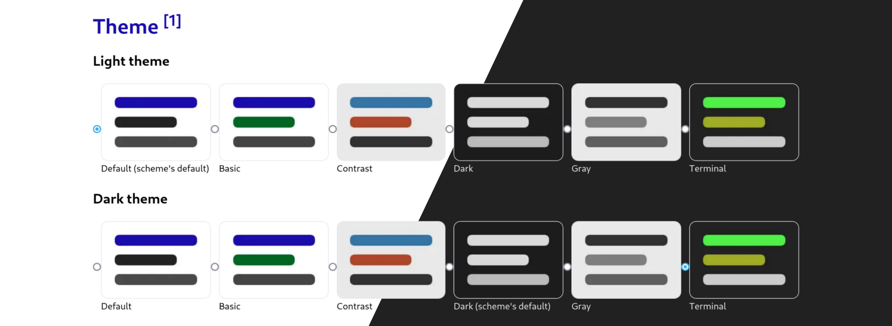

# Duckduckgo Auto Themer

<!-- Install image credit: https://github.com/gorhill/uBlock -->

<a href="https://addons.mozilla.org/en-US/firefox/addon/duckduckgo-auto-themer/"
  ></a>


Enable more fine-grained control over [duckduckgo.com](duckduckgo.com)'s light/dark theming.

Although the search engine by default changes its theme automatically in response to the color scheme of the browser (which may also mirror the user's operating system), currently we don't have the option to configure which light theme and dark theme to be applied, respectively. For example the default "Dark" one maybe a little bit hard to read compared to "Terminal".

With this extension, you can pick 2 different themes to have them applied appropriately. More advanced options (supported by Duckduckgo) can also be set for each of them.



## Building

Install [PNPM](https://pnpm.io/). Then execute:

```bash
pnpm install
pnpm build
```

Run using [web-ext](https://extensionworkshop.com/documentation/develop/getting-started-with-web-ext/):

```bash
web-ext run -s extension/
```
